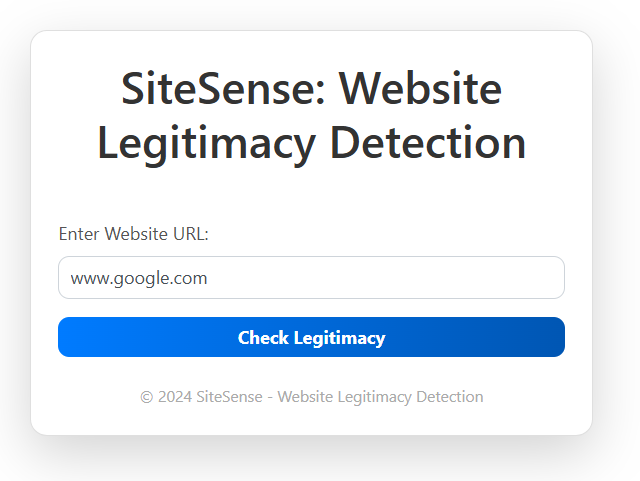
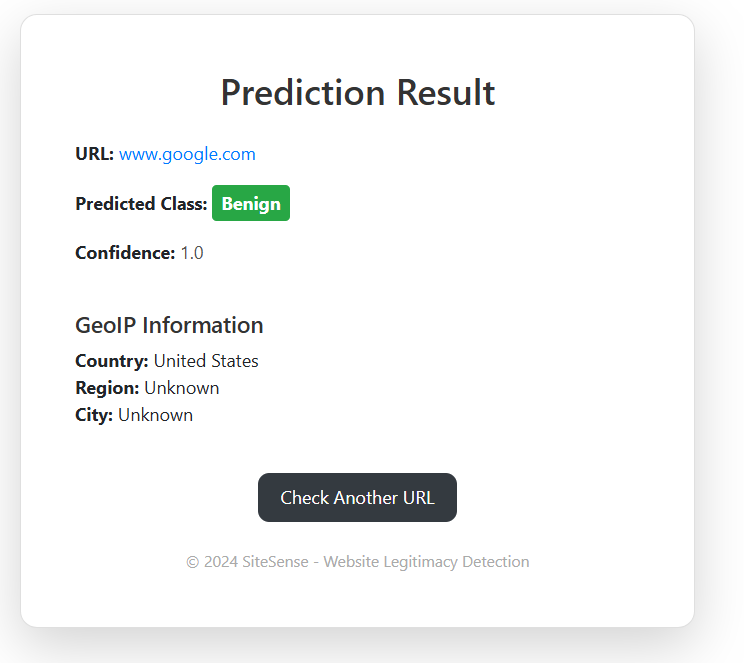

# SiteSense - Website Legitimacy Detection

SiteSense is a machine learning-powered web application designed to classify websites as either legitimate (benign) or potentially harmful (phishing). Using a Flask backend, SiteSense leverages a machine learning model trained on a dataset of URLs to help identify websites that may pose security risks.

## Problem Statement

The internet is full of websites, both legitimate and malicious. Detecting harmful or phishing websites can be challenging, especially as attackers employ sophisticated techniques to mimic legitimate domains. SiteSense aims to address this issue by providing an AI-driven solution to classify URLs into two categories: benign (legitimate) and phishing (potentially malicious). While the model attempts to provide accurate classifications, the nature of URL-based detection has inherent limitations, leading to some false positives and false negatives.

## Dataset

The model was trained using the [Malicious URLs Dataset](https://www.kaggle.com/datasets/sid321axn/malicious-urls-dataset?resource=download) available on Kaggle. This dataset contains labeled URLs categorized as `benign`, `phishing`, `malicious`, and `defacement`, which helped the model learn patterns associated with legitimate and harmful URLs.

## Model Creation

1. **Data Preprocessing**:
   - The URLs were preprocessed to extract relevant features such as the URL length, number of special characters, digit count, letter count, and whether the protocol is HTTPS.
   - A "cleaned" URL field was created by removing parts like `www` to standardize URLs for further similarity checks.

2. **Feature Engineering**:
   - **Length and Structure-Based Features**: Features like URL length, special character count, digit count, and letter count were utilized to distinguish legitimate sites from phishing attempts, as these often vary between types of URLs.
   - **Domain Similarity Checking**: Trusted domains (e.g., `facebook.com`, `google.com`) were flagged with high confidence as benign, and similarity checks (using Levenshtein distance) were employed to detect common typos or modifications often found in phishing attempts (e.g., `facebo0k.com` instead of `facebook.com`).

3. **Model Selection**:
   - After experimentation, a supervised classification algorithm was chosen, and the model was trained on the dataset, with emphasis on maximizing accuracy and minimizing false positives and false negatives.

4. **Implementation and Deployment**:
   - The trained model was implemented in a Flask application with a web interface that allows users to input a URL and check its legitimacy.
   - The app also uses a combination of the model's predictions and domain similarity checking to enhance phishing detection accuracy.

## Methods and Limitations

The model combines a machine learning-based classification model with rule-based checks to enhance phishing detection accuracy. However, due to reliance on features like URL length and structure, the model has some limitations:

- **False Positives and Negatives**: Legitimate sites with unusual URL structures may be flagged as phishing, and some phishing sites with simpler structures may pass as benign.
- **Limited Dataset Scope**: The model’s accuracy is limited by the diversity in the dataset. Including more specific features and real-world datasets could improve robustness.
- **Length-Based Detection**: The model relies on features such as URL length and special characters, which can lead to inaccuracies as not all legitimate websites have standard URL formats, and some phishing websites can mimic legitimate structures.

## Screenshots

### Home Screen


### Prediction Result


## Future Improvements

1. **Enhanced Domain Checking**: Implementing additional similarity checks to detect common phishing patterns more effectively.
2. **Improving Dataset**: Including a broader dataset of legitimate websites to reduce false positives.
3. **Feature Engineering**: Exploring additional features such as domain age, hosting information, and WHOIS data for a more comprehensive detection model.

## Usage

To run the application locally, install the dependencies, and start the Flask server.

```bash
# Clone the repository
git clone https://github.com/boss2256/SiteSense.git
cd SiteSense

# Install dependencies
pip install -r requirements.txt

# Run the application
flask run
Visit http://localhost:5000 in your browser to access the web interface.
```

## Conclusion
While SiteSense provides a basic layer of protection by identifying potentially harmful websites, it’s not a foolproof solution. Phishing detection is complex, and this model, while functional, demonstrates the need for more sophisticated methods for practical, real-world application. Future iterations could further enhance detection accuracy, ensuring greater security for users navigating the web.
